# Language Made Easy — 沉浸式 Obsidian 英语学习工作台

> English documentation: see [README-EN.md](./README-EN.md)

**Language Made Easy (LME)** 把你的 Obsidian 仓库变成一个完整的沉浸式英语学习工作台：阅读时即时查词、FSRS 间隔重复闪卡、字幕同步的视频跟读、AI 智能解析——全部在同一个地方完成，所有学习成果都以普通笔记的形式留在你的仓库里。

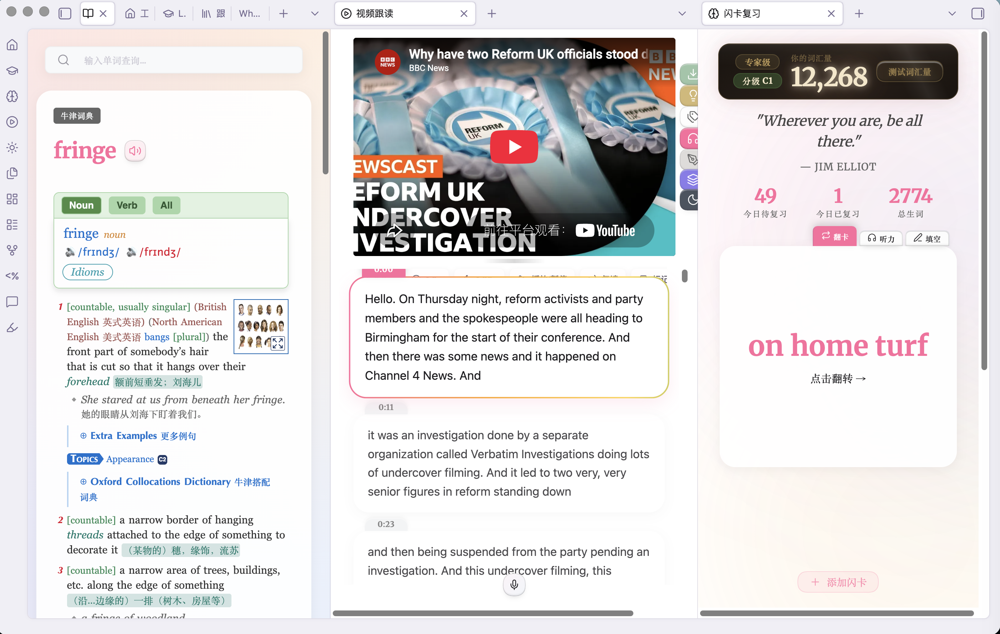

> ### 💡 免费增值说明
> 本插件基础功能免费安装、免费使用，进阶功能需升级为高级版后全部解锁，一次性买断，终身享受后续迭代版本。插件内的升级引导弹窗会展示购买链接。基础版与高级版区别见下方[功能对照表](#-基础版免费-vs-高级版完整版)。
>
> **基础版适合体验与轻度学习；重度长期学习、批量处理、多语言请升级高级版**。

---

## ✨ 全部功能模块

### 🎬 一键视频笔记 —— 从链接到可跟读的笔记，只要一步
粘贴一个 YouTube / Bilibili 链接，自动抓取标题、频道与封面，生成结构化字幕笔记并下载字幕，随时进入跟读练习。三种入口，随用随取：
- **导航页**：搜索框旁的「生成视频笔记」按钮，粘贴链接即刻生成
- **跟读工坊**：点击左侧 Ribbon 的工坊图标进入，在链接输入框中快速解析
- **YouTube 频道订阅页**：浏览订阅时对任意视频一键生成，**支持多选批量下载**（高级版功能）

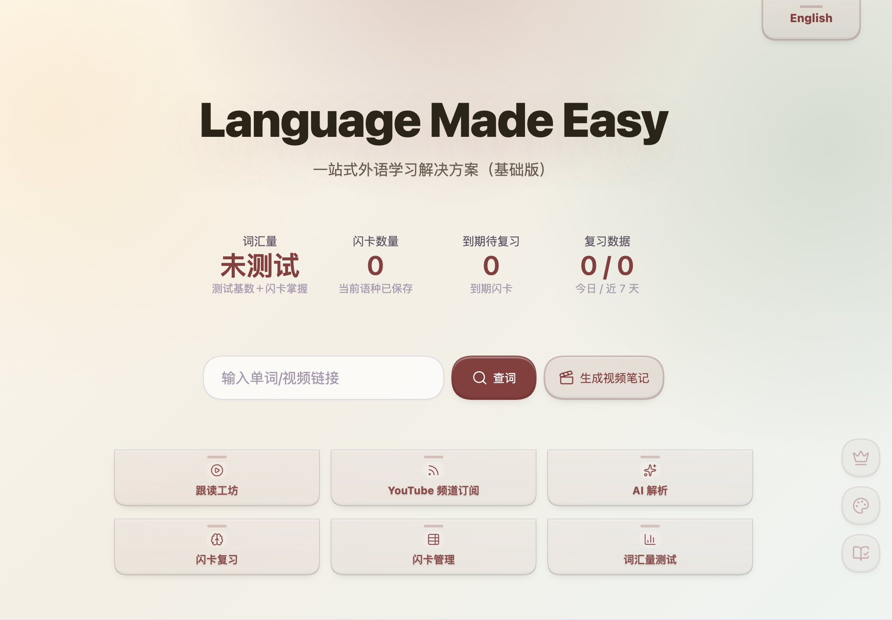

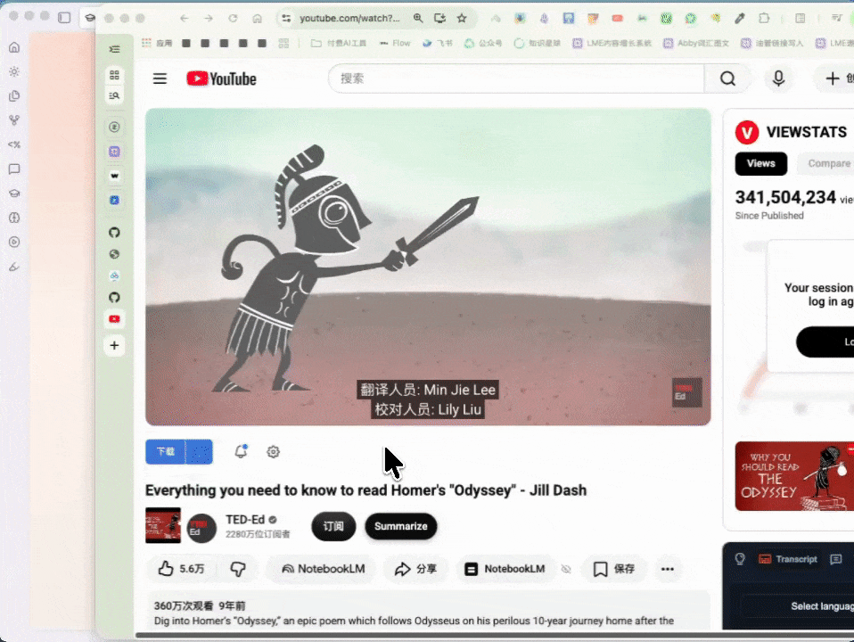

**视频笔记统一管理**：所有笔记集中在跟读工坊目录页，支持排序 / 筛选 / 分组；点击卡片直接进入跟读练习，Shift + 点击预览笔记内容。

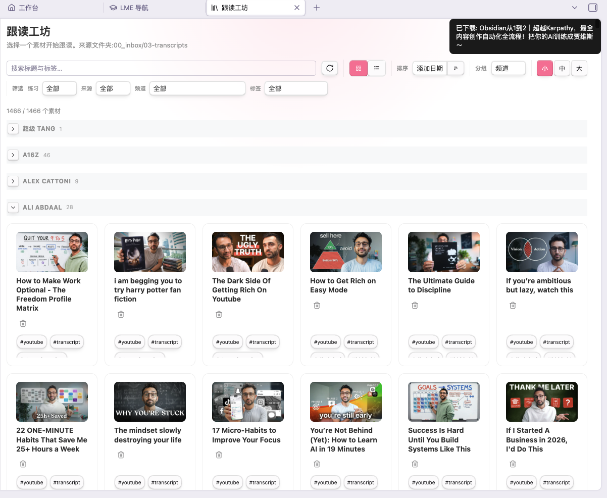

### 📖 沉浸式查词助手 —— 读到哪，查到哪
- **即时查词**：`Ctrl/Cmd + 双击`任意单词（或拖拽选中），释义侧边栏即时呈现
- **上下文抓取**：自动记录包含该词的完整句子作为例句，告别碎片化记忆
- **本地 MDX 词典**：每种语言可加载最多 5 部本地 `.mdx`/`.mdd` 专业词典（桌面端填路径，移动端可直接导入）
- **在线词典链**：有道 → Google 翻译 → MyMemory 自动回退，全部免费公共接口，无需任何 Key
- **发音播放**：智能预加载，点击即播
- **一键入本**：加入生词本，数据同步保存至 IndexedDB 与自动维护的 Markdown 文件

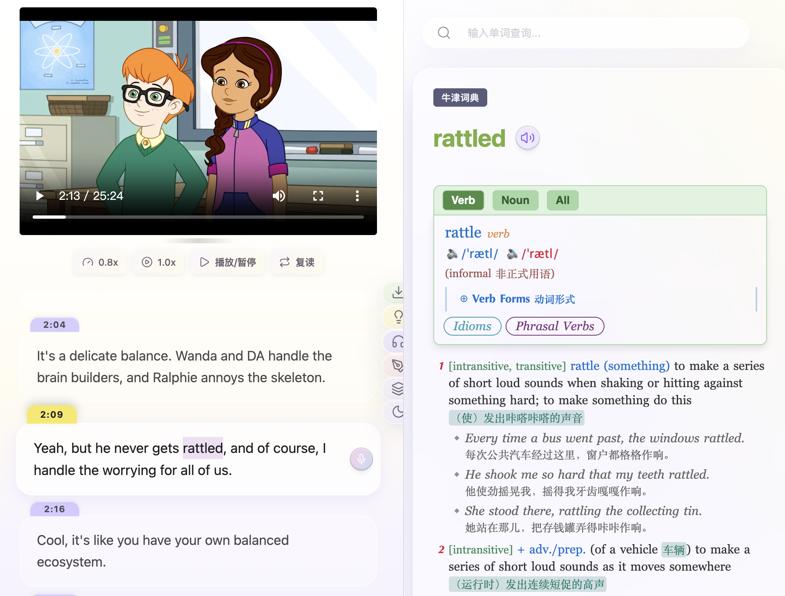

### 🧠 FSRS 闪卡复习系统 —— 学过的都记住
- 最先进的 **FSRS 调度算法**（`ts-fsrs`），为每张卡计算最优复习间隔
- **翻卡模式**：丝滑翻卡动画 + 翻页音效
- **成长看板**：全年学习热力图、复习统计、每日复习提醒
- **闪卡管理器**：搜索 / 按语言与掌握度筛选 / 排序 / 行内编辑 / 批量删除
- **学习宠物** 🐣：孵蛋、升级、随连击成长，复习也有陪伴感

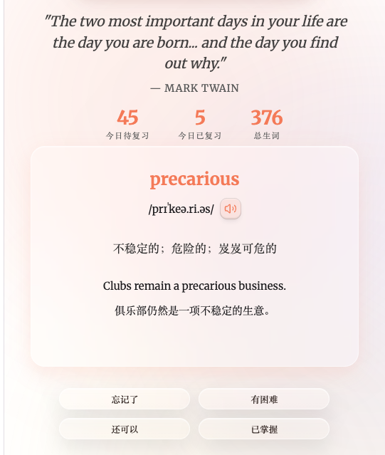 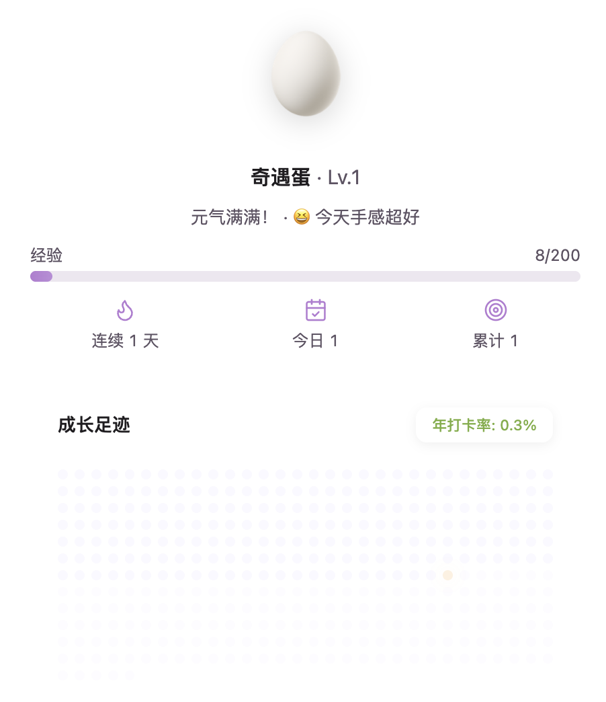

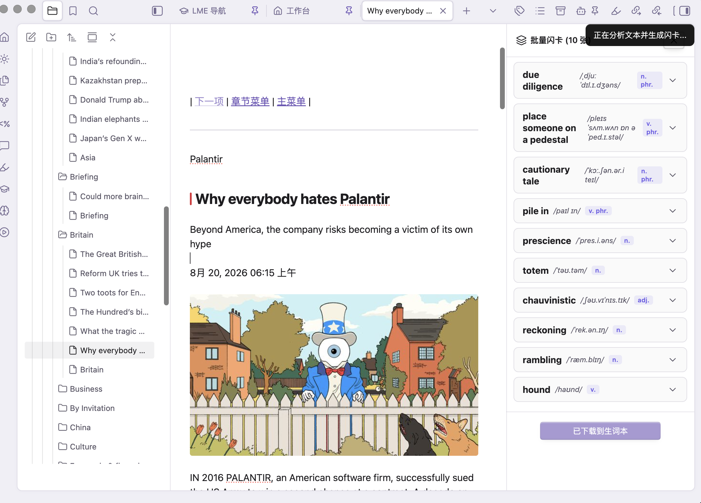

### 🎬 视频跟读工坊 —— 用真实视频学英语
- **YouTube、Bilibili、本地音视频**统一在一个工坊里
- **从链接生成视频笔记**，下载字幕写入笔记，离线随时练
- **字幕实时同步**，播放自动滚动定位
- **跟读模式 / 听写模式**一键切换
- **精准播放控制**：0.8x / 1.0x / 1.25x 倍速，-5s / -10s 快速回跳
- **工坊目录页**：全部字幕笔记统一管理，支持排序 / 筛选 / 分组

 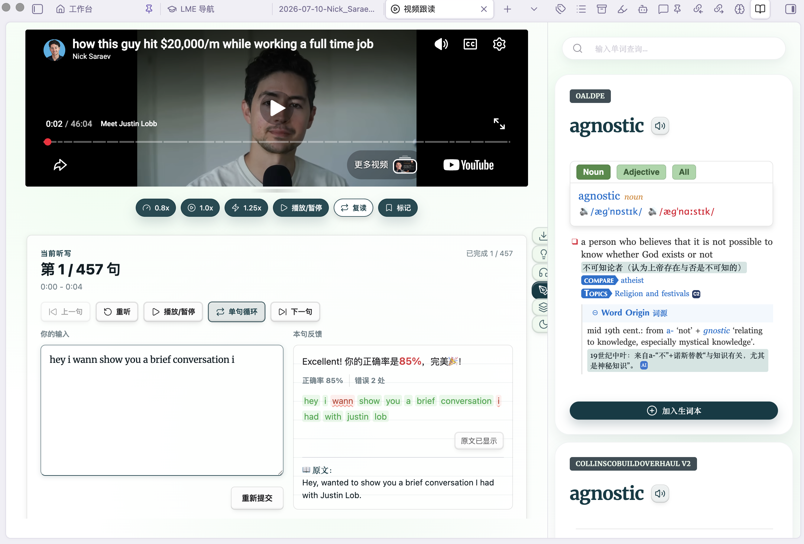

<em>跟读模式（左）与听写模式（右）</em>

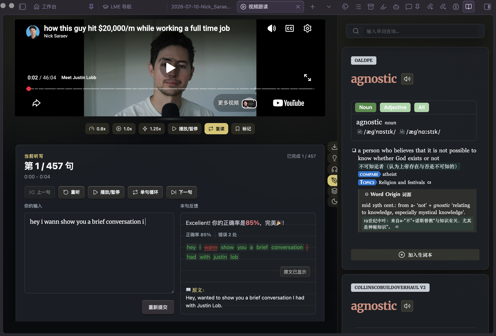

<em>专注模式</em>

### ✨ AI 智能解析 —— 自备 API Key，数据归你
- **6 套内置解析模板**：综合解析、词汇难度分析、文化背景解析、双语对照精读、泛读随堂测验、盲记填空挑战
- 报告中的**时间戳可点击**，直接跳回视频对应瞬间
- **报告历史与目录页**：浏览、搜索、分组、随时重开历史报告
- **AI 发音评分**：跟读录音多维点评
- **一键补齐闪卡**：让 AI 补全卡片缺失字段
- 支持 **OpenAI、DeepSeek、Google Gemini、Kimi、智谱 GLM、通义 Qwen、OpenRouter 及任意 OpenAI 兼容接口**——你的 Key 你做主

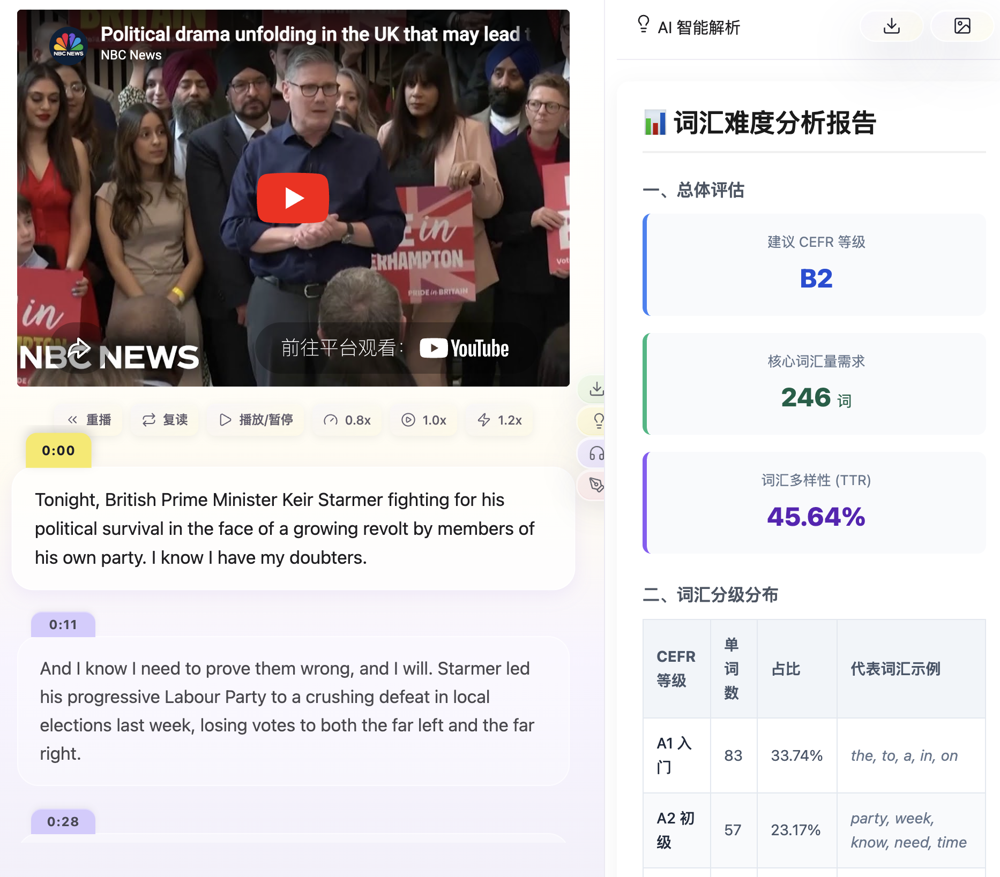

### 📺 YouTube 频道订阅
- 频道订阅 + **分类管理 + RSS 轮询 + 新视频通知**
- 卡片/列表双视图浏览，**应用内预览播放**，不用离开 Obsidian
- **一键下载生成字幕笔记**，支持多选批量下载

### 📝 更多功能
- **SRT 转字幕笔记**（单个 + 批量）
- **词汇量测试**：抽样估算你的词汇量
- 内置 **HTML 新手指南**
- **10 套主题**：经典纸墨、薄荷雅境、蔷薇柔粉、紫藤之梦、糖果派对、童心绿洲、珊瑚暖阳、海洋之心、极光棱镜、暗夜柠檬
- 桌面端 + 移动端全平台支持

---

## 🆓 基础版（免费）vs 高级版（完整版）

基础版永久免费。**高级版**（完整版）解锁以下全部高级模块——**一次买断、终身使用、永久免费更新**：

| 功能模块 | 基础版（免费） | 高级版 |
|---|:---:|:---:|
| 沉浸式查词（双击查词 / 例句抓取 / 发音 / 生词本） | ✅ | ✅ |
| 本地 MDX 词典 | **1 部** | **5 部** |
| FSRS 闪卡复习（翻卡 / 统计 / 同步 / 宠物） | **上限 250 张** | **无限量** |
| AI 解析（6 套模板 / 发音评分 / 闪卡补齐） | **部分功能** | **全部功能** |
| 视频跟读工坊（跟读 / 听写 / 倍速） | ✅ | ✅ |
| 视频笔记字幕下载 | **每天 2 次** | **无限次** |
| SRT 转笔记、词汇量测试、频道订阅与预览 | ✅ | ✅ |
| **更多语种**：德语 / 法语 / 西班牙语 / 韩语 / 俄语 / 日语 | — | ✅ |
| **9 款额外界面主题**（经典纸墨之外） | — | ✅ |
| **订阅页视频字幕一键 / 批量下载** | — | ✅ |
| **视频标注做笔记**（截图 + 定点跳回原处） | — | ✅ |
| **AI 批量闪卡生成**（任意笔记一键出卡） | — | ✅ |
| **分级词汇一键标注**（牛津 CEFR 3000/5000 + 国内考纲） | — | ✅ |
| **闪卡数据导入 / 导出**（JSON / TXT / MD / CSV） | — | ✅ |
| **AI 报告保存本地**（笔记 / HTML / 长图） | — | ✅ |
| **视频讲解卡**（播放中弹窗答题互动） | — | ✅ |
| **闪卡复习听力 / 填空复习模式** | — | ✅ |
| **自定义 AI 提示词**（添加 / 编辑你自己的模板） | — | ✅ |

## 🛒 解锁高级版（完整版）

高级版**一次买断**（非订阅）、**终身免费更新**。前往作者官方店铺购买：

- **小红书店铺**：https://xhslink.com/m/4ke3sdw1uXp
- **B站店铺**：https://b23.tv/QYtaP7T
- **视频号小店**：https://store.weixin.qq.com/shop/a/T9WX95cCebFqe4F

想咨询插件用法、了解高级版功能与优惠？扫码添加作者微信，作者亲自答疑：

---

## 🚀 安装

**社区插件市场（推荐）**：设置 → 第三方插件 → 浏览 → 搜索 `Language Made Easy` → 安装 → 启用。

**手动安装**：从最新 [Release](https://github.com/PandoraReads/language-made-easy-lite/releases) 下载 `main.js`、`manifest.json`、`styles.css`，放入 `.obsidian/plugins/language-made-easy/`，然后在第三方插件中启用。

### 快速上手
1. **AI 功能（可选）**：在插件设置中添加大模型并填入你自己的 API Key（OpenAI / DeepSeek / Gemini / Kimi / GLM / Qwen / OpenRouter / 自定义兼容接口）
2. **词典（可选）**：注册本地 MDX 词典，或直接使用免费在线词典链
3. **生词本**：指定自动维护的生词文件所在文件夹
4. 点击左侧ribbon 的学士帽图标打开**导航面板**，开始探索

## 🌐 网络使用说明

插件完全可离线使用，以下请求均为可选、且由你主动触发：

- **查词 / 翻译 / 发音**：`dict.youdao.com`、`translate.googleapis.com` / `translate.google.com`、`dict.iciba.com`、`api.mymemory.translated.net`
- **视频与字幕**（打开/下载视频、刷新订阅时）：`www.youtube.com`、`i.ytimg.com` / `img.youtube.com`、`api.bilibili.com`、`www.bilibili.com`、`b23.tv`；移动端 YouTube 嵌入走 Obsidian 官方代理 `releases.obsidian.md`
- **AI 功能**（仅当你配置了模型时）：调用你选择的服务商端点，使用**你自己的 API Key**
- MDX 词典为本地文件，不下载任何内容

## 🔒 隐私

- **零遥测、零统计、零账号**
- 闪卡同步走**你自己的**仓库同步通道，不经我们的服务器
- 离开你设备的数据只有：你主动发起的查词/翻译请求，以及**你自己配置的** AI 服务商调用

**仓库外文件**：词典设置可指向存储在仓库外的 MDX 文件；插件只读取你明确选择的文件。

## 🛠 开发与构建

- 环境要求：Node.js 18+
- `npm install` 安装依赖 · `npm run dev` 开发监听 · `npm run build:release` 发布构建（非压缩可读产物，社区市场要求） · `npm test` 校验脚本

## 📄 许可证

[GPL-3.0](./LICENSE)

## ❤️ 支持与反馈

发现问题或有想法？欢迎在仓库提 Issue。也可以在微博 / 小红书 / 视频号找到作者 **PandoraReads**（潘多拉的数字花园）。

---

*"让语言学习像呼吸一样自然。" — Language Made Easy*
